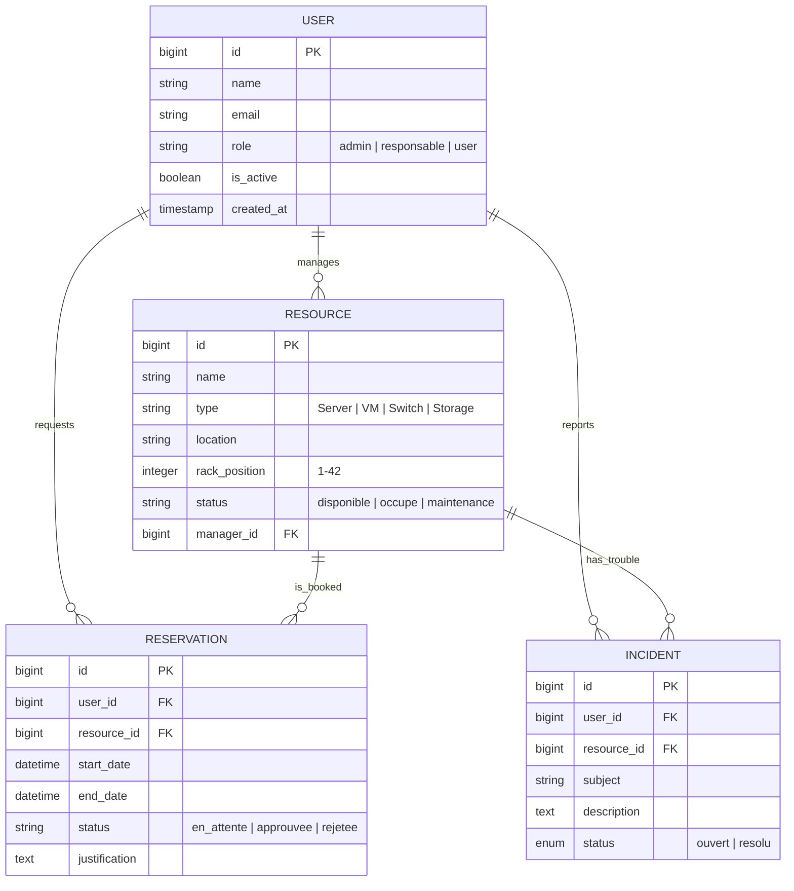

# 📑 RAPPORT TECHNIQUE D'INGÉNIERIE : DC-MANAGER v2.1

## 🏛️ MÉMOIRE DE CONCEPTION ET RÉALISATION

---

## 📁 SOMMAIRE
1.  [Vision et Objectifs Stratégiques](#1-vision-et-objectifs-stratégiques)
2.  [Modélisation de la Base de Données](#2-modélisation-de-la-base-de-données)
3.  [Fonctionnalités Implémentées](#3-fonctionnalités-implémentées)
4.  [Choix Technologiques et Justifications](#4-choix-technologiques-et-justifications)
5.  [Architecture Logicielle (Patterns)](#5-architecture-logicielle-patterns)
6.  [Sécurité et Performance](#6-sécurité-et-performance)

---

## 1. VISION ET OBJECTIFS STRATÉGIQUES

**DC-Manager** est né de la nécessité de moderniser la gestion opérationnelle du Data Center de la **FST Tanger**. L'objectif était de remplacer les méthodes disparates (Excel, formulaires papier) par une plateforme interactive unique offrant une vision à 360° du parc informatique.

---

## 2. MODÉLISATION DE LA BASE DE DONNÉES

La conception du schéma relationnel a été pensée pour garantir l'intégrité des données tout en permettant une flexibilité maximale pour l'évolution future.

### 2.1 Diagramme Entité-Association (ERD)

---

## 3. FONCTIONNALITÉS IMPLÉMENTÉES

Le système est structuré autour de quatre piliers fonctionnels majeurs :

### 3.1 Gestion d'Inventaire Intelligente
- **Catalogue Dynamique :** Recherche multicritères (type, status, localisation) avec barre de commande (Ctrl+K).
- **Rack Map 42U :** Visualisation physique interactive des équipements dans la baie serveur.
- **Reporting PDF :** Génération automatique de bilans mensuels avec KPIs d'utilisation.

### 3.2 Cycle de Vie des Réservations
- **Workflow d'Approbation :** Système de validation par les managers/admin avec notifications temps réel.
- **Calendrier de Disponibilité :** Vision claire des occupations futures pour éviter les doubles réservations.

### 3.3 Maintenance et Incidents
- **Ticketing Simplifié :** Signalement rapide des dysfonctionnements par les utilisateurs.
- **Suivi des Interventions :** Tableaux de bord dédiés pour les ingénieurs (Espace Responsable).

### 3.4 Support IA & UX
- **Chatbot Conversationnel :** Assistance de premier niveau pour guider les utilisateurs.
- **Interface Moderne :** Mode sombre natif, feedback visuel via Toast notifications, et fluidité AJAX.

---

## 4. CHOIX TECHNOLOGIQUES ET JUSTIFICATIONS

| Technologie | Rôle | Justification de l'Ingénieur |
| :--- | :--- | :--- |
| **Laravel 10** | Backend Framework | Offre une structure MVC rigoureuse, une sécurité native (Eloquent, CSRF protections) et une excellente gestion des relations de base de données. |
| **MySQL 8.0** | SGBDR | Choisi pour sa maturité, ses performances transactionnelles (ACID) cruciales pour la cohérence des réservations. |
| **Vanilla JS (ES6)** | Frontend Logic | Choix stratégique de **refus de la dette technique**. Absence de frameworks lourds (React/Vue) pour garantir une légèreté extrême et une maintenance simplifiée. |
| **Chart.js** | Visualisation | Bibliothèque robuste pour transformer les données brutes en indicateurs visuels parlants. |
| **Vite** | Build Tool | Standard moderne pour la compilation ultra-rapide des assets et le Hot Module Replacement. |

---

## 5. ARCHITECTURE LOGICIELLE (PATTERNS)

L'application suit les meilleures pratiques de développement moderne :

- **Service Layer Pattern :** La logique complexe des rapports et du chatbot est isolée dans des classes de service dédiées.
- **Observer Pattern :** Les notifications et les logs sont déclenchés automatiquement via les `Events` Laravel.
- **Middleware Security :** Filtrage granulaire des accès basé sur les rôles (`Admin`, `Responsable`, `Candidat`).

---

## 6. SÉCURITÉ ET PERFORMANCE

- **Sécurité :** Hachage des mots de passe (Bcrypt), protection contre les injections SQL via l'ORM, et validation stricte des entrées (Requests).
- **Performance :** Optimisation des requêtes (Eager Loading), minification des assets via Vite, et interface "Stateless" pour les interactions rapides.

---
> [!IMPORTANT]
> Ce projet démontre la capacité d'intégrer des technologies modernes pour résoudre des problématiques d'infrastructure réelles, tout en respectant les standards académiques les plus élevés.

**Réalisé par Homam Dany - IDAI FST Tanger**
