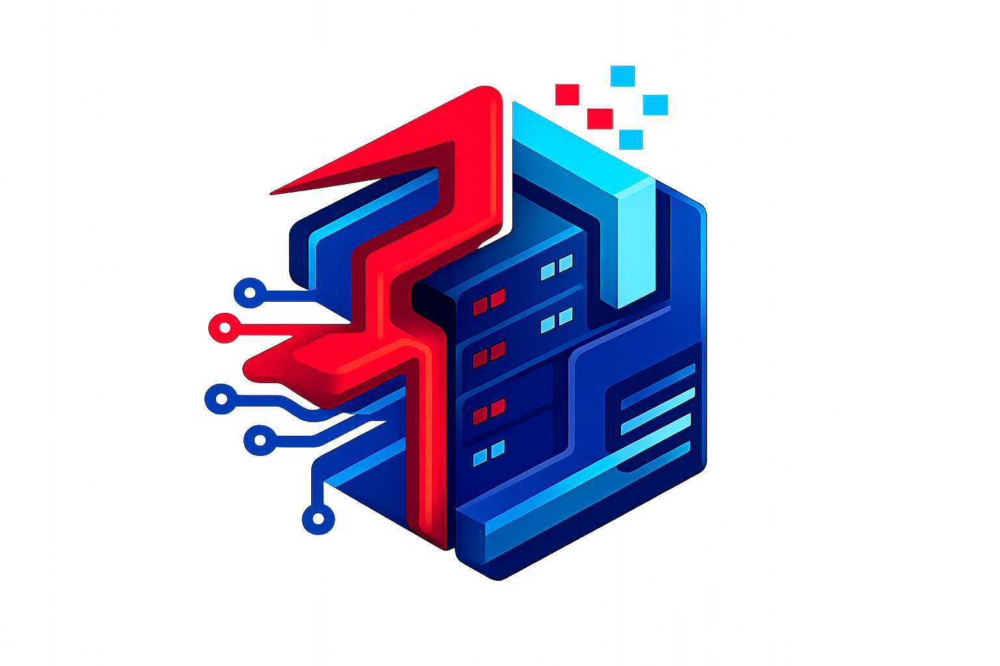

<div align="center">



# 🏢 Bughaz Digital — Datacenter Resource Reservation

**Plateforme de gestion et de réservation de ressources datacenter**

<p>
  
</p>


[](https://github.com/s-elbourmaki/datacenter-resource-reservation)

</div>

---

## 📖 Description

**Bughaz Digital** est une plateforme web complète permettant la gestion, la réservation et le monitoring des ressources d'un datacenter (serveurs, réseaux, stockage, etc.). Elle offre un espace multi-rôles sécurisé pour les utilisateurs, les responsables et les administrateurs.

---

## ✨ Fonctionnalités

| 🔑 Fonctionnalité | Description |
|---|---|
| 🗺️ **Carte mondiale interactive** | Visualisation D3.js des datacenters dans le monde |
| 📦 **Catalogue de ressources** | Consultation en temps réel des ressources disponibles |
| 📅 **Réservation en ligne** | Système de demandes avec workflow de validation |
| 👥 **Multi-rôles** | Utilisateur, Responsable, Ingénieur, Administrateur |
| 📊 **Dashboard analytique** | Statistiques, graphiques, et rapports mensuels PDF |
| 🛰️ **Rack Map** | Visualisation interactive des baies serveur |
| 🔔 **Notifications** | Système de notifications en temps réel |
| 🔐 **Authentification sécurisée** | Login, reset mot de passe, Magic Link |
| 🤖 **Chatbot intégré** | Assistant virtuel de navigation |
| 🌗 **Mode sombre / clair** | Thème adaptatif complet |
| 🖨️ **QR Code** | Génération de QR codes pour chaque ressource |
| 🔎 **Command Palette** | Recherche rapide (style VSCode) |

---

## 🛠️ Stack Technique

<div align="center">

| Backend | Frontend | Base de données | DevOps / Build |
|:---:|:---:|:---:|:---:|
|  |  |  |  |
|  |  | |  |
| |  | |  |

</div>

**Librairies clés :**
- 🗺️ [D3.js](https://d3js.org) & [TopoJSON](https://github.com/topojson/topojson) — Cartographie interactive
- 📄 [Laravel DomPDF](https://github.com/barryvdh/laravel-dompdf) — Génération de rapports PDF
- 🔲 [Simple QrCode](https://www.simplesoftware.io/docs/simple-qrcode) — Génération de QR codes
- 🔒 [Laravel Sanctum](https://laravel.com/docs/sanctum) — API token authentication

---

## 🚀 Installation

```bash
# 1. Cloner le projet
git clone https://github.com/s-elbourmaki/datacenter-resource-reservation.git
cd datacenter-resource-reservation

# 2. Installer les dépendances PHP
composer install

# 3. Installer les dépendances Node
npm install

# 4. Configurer l'environnement
cp .env.example .env
php artisan key:generate

# 5. Configurer la base de données dans .env
# DB_DATABASE=datacenter
# DB_USERNAME=root
# DB_PASSWORD=your_password

# 6. Initialiser la base de données
php artisan migrate --seed

# 7. Compiler les assets
npm run build

# 8. Lancer le serveur
php artisan serve
```

---

## 👤 Rôles & Accès

| Rôle | Accès |
|---|---|
| 👤 **Utilisateur** | Catalogue, réservation, historique, profil |
| 🛠️ **Responsable** | Gestion demandes, incidents, ressources |
| 🔧 **Ingénieur** | Dashboard technique, Rack Map |
| 👑 **Administrateur** | Gestion complète, utilisateurs, logs, rapports |

---

## 📸 Aperçu

| Page d'accueil | Dashboard | Catalogue |
|:---:|:---:|:---:|
| 🌍 Carte mondiale interactive | 📊 Statistiques en temps réel | 📦 Ressources filtrables |

---

## 📁 Structure du Projet

```
├── app/
│   ├── Http/Controllers/   # Contrôleurs (Auth, Admin, Resource, Reservation...)
│   └── Models/             # Modèles Eloquent
├── database/
│   ├── migrations/         # Schéma de base de données
│   └── seeders/            # Données de test
├── resources/
│   ├── css/                # Styles par module
│   ├── js/                 # Scripts par module (D3, chatbot, dashboard...)
│   └── views/              # Templates Blade
├── routes/
│   └── web.php             # Toutes les routes de l'application
└── public/
    ├── images/             # Assets médias
    └── build/              # Assets compilés (Vite)
```

---

## 🤝 Contribution

Les contributions sont les bienvenues ! Pour proposer une amélioration :

1. **Fork** le projet
2. Créez votre branche (`git checkout -b feature/MonAmeloration`)
3. **Commitez** vos changements (`git commit -m 'Ajout: MonAmeloration'`)
4. **Pushez** vers la branche (`git push origin feature/MonAmeloration`)
5. Ouvrez une **Pull Request**

---

<div align="center">

**Développé avec ❤️ par [Salim El Bourmaki](https://github.com/s-elbourmaki)**

</div>
